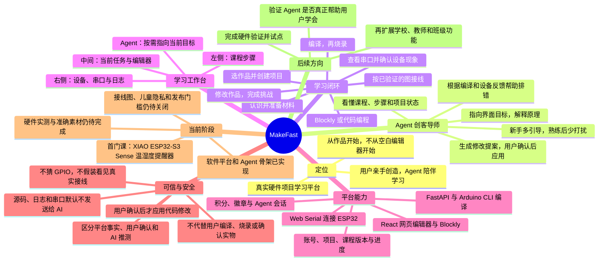

# MakeFast Agent 与平台脑图

```mermaid
mindmap
  root((MakeFast))
    定位
      真实硬件项目学习平台
      从作品开始，不从空白编辑器开始
      用户亲手创造，Agent 陪伴学习
    Agent 创客导师
      看懂课程、步骤和项目状态
      指向界面目标，解释原理
      根据编译和设备反馈帮助排错
      生成修改提案，用户确认后应用
      新手多引导，熟练后少打扰
    学习闭环
      选作品并创建项目
      认识并准备材料
      按已验证的图接线
      Blockly 或代码编程
      编译，再烧录
      查看串口并确认设备现象
      修改作品，完成挑战
    学习工作台
      左侧：课程步骤
      中间：当前任务与编辑器
      右侧：设备、串口与日志
      Agent：按需指向当前目标
    平台能力
      React 网页编辑器与 Blockly
      FastAPI 与 Arduino CLI 编译
      Web Serial 连接 ESP32
      账号、项目、课程版本与进度
      积分、徽章与 Agent 会话
    可信与安全
      区分平台事实、用户确认和 AI 推测
      不猜 GPIO，不假装看见真实接线
      不代替用户编译、烧录或确认实物
      源码、日志和串口默认不发送给 AI
      用户确认后才应用代码修改
    当前阶段
      软件平台和 Agent 骨架已实现
      首门课：XIAO ESP32-S3 Sense 温湿度提醒器
      硬件实测与准确素材仍待完成
      接线图、儿童隐私和发布门槛仍待关闭
    后续方向
      完成硬件验证并试点
      验证 Agent 是否真正帮助用户学会
      再扩展学校、教师和班级功能
```
